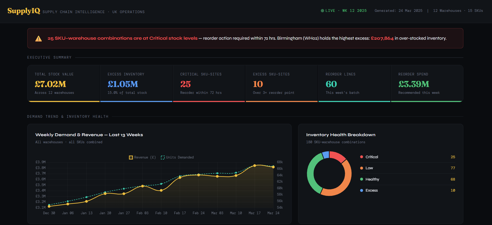

# Supply Chain Analytics



Python-powered supply chain optimisation model for UK multi-warehouse operations. The project simulates 52 weeks of demand, quantifies overstock risk, and automates reorder recommendations using EOQ plus safety-stock logic.

## Executive Summary

This project demonstrates how analytics can support tactical inventory decisions across a distributed network of warehouses.

Key outcomes from the model:
- Detects and quantifies excess inventory exposure (project brief target: up to GBP 1.8M in overstock risk).
- Classifies inventory health across all SKU-site combinations.
- Produces weekly reorder recommendations using lead-time-aware reorder points.
- Exports operational reports and management-ready visuals for rapid decision support.

The implementation is fully reproducible and built with Python, pandas, NumPy, SciPy, and Matplotlib.

## Business Context

Multi-site supply chains often face two costly problems at the same time:
- Understocking, which increases service failure risk.
- Overstocking, which ties up working capital and raises carrying costs.

This project addresses both by combining synthetic demand simulation, inventory policy calculations, and reporting automation.

## Technical Objectives

1. Generate a realistic synthetic demand history for 12 UK warehouses and 15 SKUs.
2. Estimate per SKU-site demand mean and variability.
3. Compute safety stock, reorder point, and EOQ-informed reorder quantities.
4. Flag critical, low, healthy, and excess stock positions.
5. Publish weekly reorder queues ranked by financial impact.
6. Export CSV, Excel, and chart outputs suitable for stakeholder communication.

## Scope

- Geography: 12 UK warehouse locations.
- Product range: 15 SKUs across Electronics, Accessories, Industrial, and Lighting.
- Time horizon: 52 weekly periods.
- Unit of analysis: warehouse x product (180 SKU-site combinations).

## Methodology

### 1) Synthetic Demand Generation

The demand engine in supply_chain_analytics.py creates weekly demand per warehouse and product using:
- Seasonal component (sinusoidal pattern).
- Mild annual trend (0.85 to 1.15 scaling).
- Gaussian noise (mean 1.0, sigma 0.12).

This creates realistic volatility while keeping the dataset deterministic through a fixed random seed.

### 2) Inventory Policy Calculations

For each warehouse-product pair:

- Lead time is sampled between 3 and 13 days.
- Service level is 95 percent, with z-score from SciPy normal distribution.
- Holding cost is 20 percent of unit cost per year.
- Fixed order cost is GBP 50 per order.

Core formulas:

- Safety Stock = z x sigma_demand x sqrt(lead_time_weeks)
- Reorder Point = mean_demand x lead_time_weeks + Safety Stock
- EOQ = sqrt((2 x annual_demand x order_cost) / annual_holding_cost)
- Excess Units = max(0, Stock On Hand - 3 x Reorder Point)

### 3) Inventory Health Classification

Weeks of stock coverage:
- Critical: <= 1 week
- Low: > 1 and <= 2 weeks
- Healthy: > 2 and <= 6 weeks
- Excess: > 6 weeks

### 4) Reorder Prioritisation

Rows where Stock On Hand <= Reorder Point are included in the weekly reorder queue.

Urgency logic:
- URGENT for lead time >= 12 days
- High for lead time >= 9 days
- Normal otherwise

## Repository Structure

- supply_chain_analytics.py: End-to-end data simulation, policy logic, KPIs, exports, and chart generation.
- supply_chain_dashboard.html: Executive dashboard template powered by Chart.js with sample metrics and tables.
- outputs/: Generated after execution (CSV, XLSX, PNG artifacts).
- DATA_DICTIONARY.md: Field-level definitions for all generated synthetic datasets.

## Generated Outputs

Running the pipeline creates:

- outputs/demand_weekly.csv
- outputs/inventory_snapshot.csv
- outputs/reorder_recommendations.csv
- outputs/supply_chain_report.xlsx
- outputs/01_demand_trend.png
- outputs/02_excess_by_warehouse.png
- outputs/03_status_donut.png
- outputs/04_reorder_heatmap.png

## How To Run

## 1) Install dependencies

```bash
pip install pandas numpy scipy matplotlib openpyxl
```

## 2) Execute pipeline

```bash
python supply_chain_analytics.py
```

## 3) Review outputs

- Open CSV/XLSX files in outputs/ for analysis.
- Use generated PNG files in reports or presentations.
- Open supply_chain_dashboard.html in a browser for dashboard-style storytelling.

## KPI Interpretation Guide

- Total Stock Value: Capital currently tied up in inventory.
- Excess Inventory Value: Estimated overstock cost exposure.
- Critical SKU-Sites: Immediate replenishment risk.
- Reorder Spend: Expected short-term purchasing outflow.
- Top Excess Positions: Candidates for transfer, markdown, or liquidation.

## Reproducibility

- Random seed is fixed to ensure repeatable synthetic output.
- All business rules are hard-coded and transparent in the main script.
- End-to-end run produces stable artifacts for audit and validation.

## Limitations

- Data is synthetic and intended for modelling demonstration.
- No explicit stockout penalty or service-failure cost optimisation objective.
- No inter-warehouse transfer optimisation in current version.
- Lead time is randomly sampled rather than supplier-specific.

## Recommended Next Enhancements

1. Add supplier-level lead-time distributions and reliability metrics.
2. Include stockout cost and fill-rate optimisation as objective functions.
3. Add transfer recommendations between warehouses before external reorder.
4. Build a scheduled ETL pipeline for real ERP data replacement.
5. Deploy an interactive dashboard connected directly to generated outputs.

## Data Dictionary

This section documents the synthetic datasets generated by the pipeline.

### Dataset 1: demand_weekly.csv

Description: Weekly demand by warehouse and SKU.

Expected row count:
- 52 weeks x 12 warehouses x 15 products = 9,360 rows.

| Column | Type | Unit | Example | Description |
|---|---|---|---|---|
| week | date/datetime | Calendar date | 2025-03-24 | Week ending date (W-MON frequency). |
| warehouse_id | string | N/A | WH01 | Unique warehouse code. |
| city | string | N/A | Manchester | Warehouse city name. |
| region | string | N/A | North | UK regional grouping for the warehouse. |
| product_id | string | N/A | P009 | Unique product/SKU code. |
| product_name | string | N/A | Control Board | Human-readable product name. |
| category | string | N/A | Industrial | Product family/category. |
| unit_cost | float | GBP per unit | 120.00 | Unit purchase/holding valuation cost. |
| weekly_demand | integer | Units/week | 641 | Simulated weekly demand quantity. |

### Dataset 2: inventory_snapshot.csv

Description: Current stock position and derived inventory policy metrics by warehouse and SKU.

Expected row count:
- 12 warehouses x 15 products = 180 rows.

| Column | Type | Unit | Example | Description |
|---|---|---|---|---|
| warehouse_id | string | N/A | WH02 | Unique warehouse code. |
| city | string | N/A | Birmingham | Warehouse city name. |
| region | string | N/A | Midlands | UK regional grouping. |
| product_id | string | N/A | P008 | Unique product/SKU code. |
| product_name | string | N/A | Sensor Unit | Product name. |
| category | string | N/A | Industrial | Product category. |
| unit_cost | float | GBP per unit | 88.00 | Unit cost used in valuation and EOQ calculations. |
| stock_on_hand | integer | Units | 3026 | Simulated current on-hand stock level. |
| avg_weekly | float | Units/week | 495.2 | Mean weekly demand over 52 weeks. |
| std_weekly | float | Units/week | 77.4 | Standard deviation of weekly demand over 52 weeks. |
| lead_time_days | integer | Days | 10 | Simulated supplier lead time. |
| safety_stock | integer | Units | 48 | Buffer stock for service-level protection. |
| reorder_point | integer | Units | 896 | Stock threshold that triggers reorder action. |
| reorder_qty | integer | Units | 2092 | Recommended order quantity (EOQ minimum with floor rule). |
| stock_value | float | GBP | 266288.00 | On-hand stock valuation (stock_on_hand x unit_cost). |
| weeks_of_stock | float | Weeks | 6.11 | Coverage ratio (stock_on_hand / avg_weekly). |
| excess_units | integer | Units | 1499 | Units above 3 x reorder_point. |
| excess_value | float | GBP | 131912.00 | Financial value of excess_units. |
| status | categorical | N/A | Excess | Coverage class: Critical, Low, Healthy, Excess. |

### Dataset 3: reorder_recommendations.csv

Description: Weekly reorder queue for SKU-site rows where stock is at or below reorder point.

Filter condition:
- stock_on_hand <= reorder_point

| Column | Type | Unit | Example | Description |
|---|---|---|---|---|
| warehouse_id | string | N/A | WH01 | Warehouse code. |
| city | string | N/A | Manchester | Warehouse city. |
| region | string | N/A | North | Regional grouping. |
| product_id | string | N/A | P009 | Product code. |
| product_name | string | N/A | Control Board | Product name. |
| category | string | N/A | Industrial | Product category. |
| unit_cost | float | GBP per unit | 120.00 | Unit cost. |
| stock_on_hand | integer | Units | 537 | Current stock level. |
| avg_weekly | float | Units/week | 601.8 | Mean weekly demand. |
| std_weekly | float | Units/week | 81.2 | Demand variability. |
| lead_time_days | integer | Days | 9 | Supplier lead time. |
| safety_stock | integer | Units | 51 | Safety stock quantity. |
| reorder_point | integer | Units | 918 | Reorder trigger threshold. |
| reorder_qty | integer | Units | 2381 | Recommended order quantity. |
| stock_value | float | GBP | 64440.00 | Current stock valuation. |
| weeks_of_stock | float | Weeks | 0.89 | Weeks of inventory cover. |
| excess_units | integer | Units | 0 | Excess units above 3 x reorder point. |
| excess_value | float | GBP | 0.00 | Monetary value of excess units. |
| status | categorical | N/A | Critical | Inventory status class. |
| reorder_cost | float | GBP | 285720.00 | Estimated purchase cost (reorder_qty x unit_cost). |
| urgency | categorical | N/A | High | Priority bucket: Normal, High, URGENT. |

### Categorical Field Definitions

#### status
- Critical: weeks_of_stock <= 1
- Low: 1 < weeks_of_stock <= 2
- Healthy: 2 < weeks_of_stock <= 6
- Excess: weeks_of_stock > 6

#### urgency
- URGENT: lead_time_days >= 12
- High: lead_time_days >= 9 and < 12
- Normal: lead_time_days < 9

For a standalone version of this dictionary, see DATA_DICTIONARY.md.

## Author

Prepared as a supply chain optimisation capstone for UK multi-warehouse operations (March 2025 baseline).